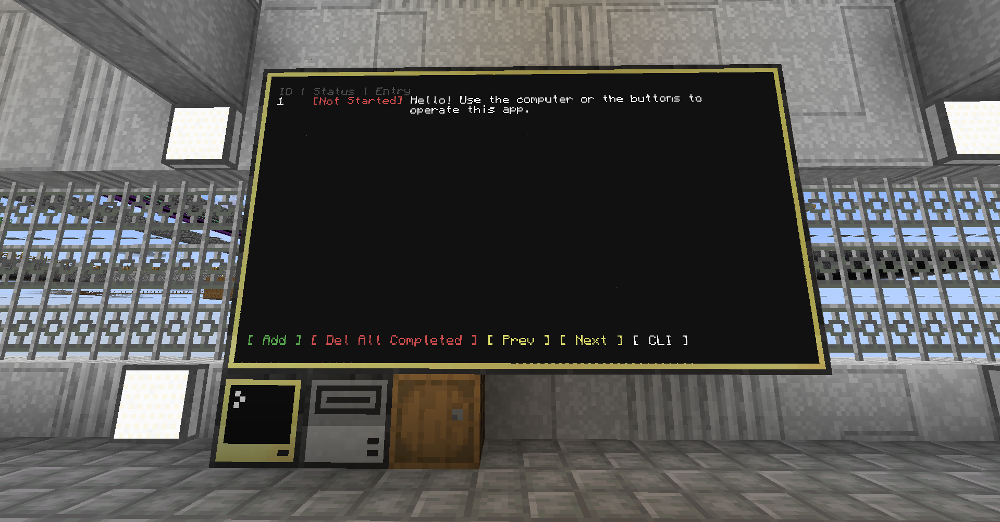

# ZenList

ZenList is a to-do program for the CC: Tweaked mod.

## Specs

-   Advanced Computer
-   Advanced Monitor (7x4)

## To run

```
zenlist
```

## Available commands

```
add     Invokes add wizard, e.g. "add". Then you can input the to-do entry
edit    "edit <id>", e.g. "edit 3". Then you can input the updated entry
del     "del <id>", e.g. "del 3". It should give you a succesful return message
refr    Refresh page, e.g. "refr"
exit    Exit app, e.g. "exit"
```

These docs may be abridged in-game due to screen size limitations.

## Reset list

If you want to reset your to-do list, type

```
rm zenlist_data
```

in your computer's command line.

## GUI



## Known limitations

-   I set input to have a maximum character count of 511 because it just gets ridiculous to display beyond that
-   Some lines of code may be are redundant
-   The features provided by the GUI buttons are limited, so you'd need to touch the `CLI` button to type the command down yourself

## Known bugs

No bugs under normal (and courteous) use.

The only data validation is when adding or editing an entry. I deliberately did not have an issues tab, so if you encounter any issues, you may fix it yourself.

## Example data format

```
{
  {
    id = 1,
    text = "Hello! Use the computer or the buttons to operate this app.",
    page = 1,
    status = "Completed",
  },
  {
    id = 2,
    text = "New entry",
    page = 1,
    status = "Completed",
  },
  {
    id = 3,
    text = "Another new entry",
    page = 1,
    status = "In Progress",
  },
  {
    id = 4,
    text = "Another new entry again",
    page = 1,
    status = "In Progress",
  },
  {
    id = 5,
    text = "Another new entry again and again and again and again and again",
    page = 1,
    status = "Not Started",
  },
...
}
```
